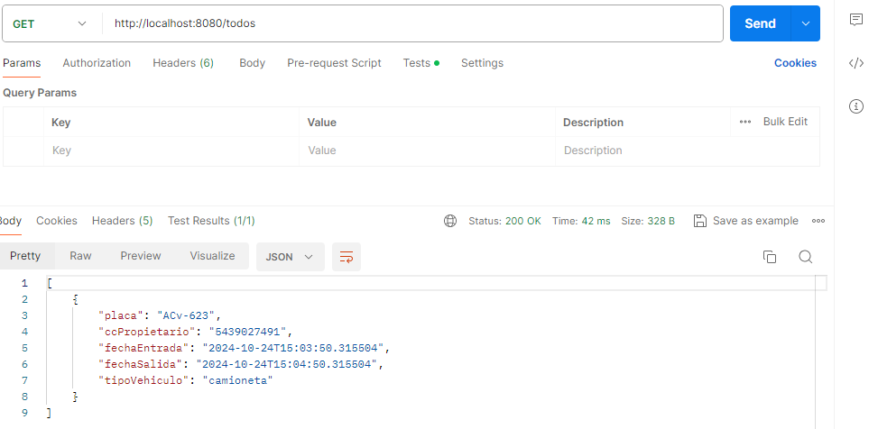
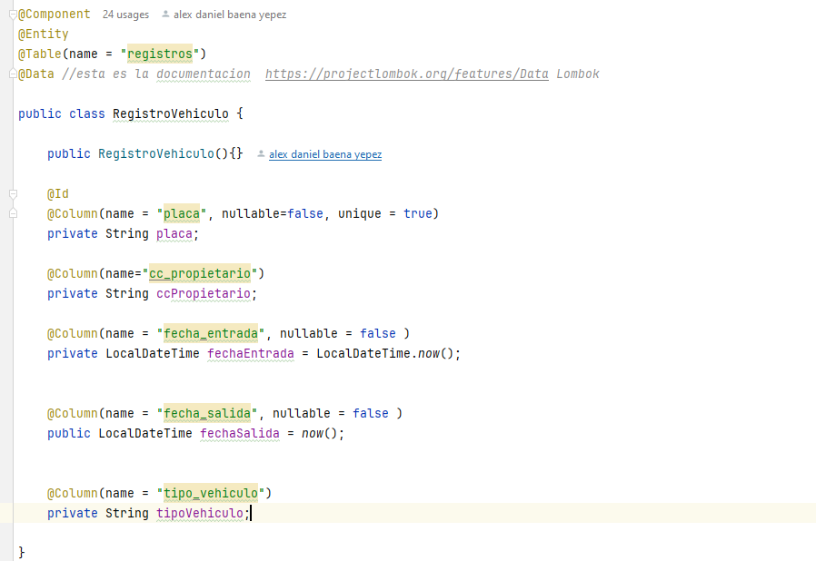

# Backend Parqueadero

Esta aplicacion trata del backend del parqueadero, tiene funciones **CRUD**  como agregar, editar, eliminar, listar los objetos en base de datos.
Construida con Spring Boot. El backend es un microservicio.

Para la cuenta de cobro segun las horas, fue necesario usar la api
DataTime y operadores aritmeticos.
Al agregar un vehiculo y luego retirarlo se generan de
forma automatica fechas de entrada y salida segun hora local
y al retirar el vehiculo se compute el valor a cobrar segun las
fechas generadas |

```java
@PostMapping("/ingreso")
public ResponseEntity<RegistroVehiculo> ingreso(@RequestBody RegistroVehiculo registroVehiculo) {
    RegistroVehiculo registro = registroService.guardar(registroVehiculo);
    return ResponseEntity.ok(registro);
}
```



## Utilizo una Query para obtener la fecha de entrada
Y calcular el valor a cobrar

```java
ublic interface Repositorio extends JpaRepository<RegistroVehiculo, String> {

    @Query(value = "SELECT  fecha_entrada  FROM registros", nativeQuery = true)
    LocalDateTime  findFechaEntrada ();
}
```

## Metodo GetAll

```java
@GetMapping
public ResponseEntity<List<RegistroVehiculo>> getAll() {
    return registroService.all();
}
```


```java

```
## JPA
